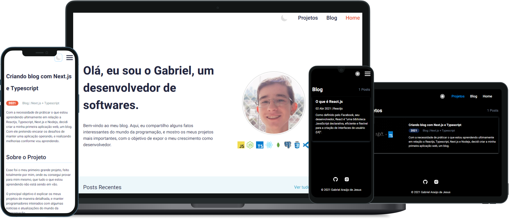

<h1 align="center">
  
</h1>

<h4 align="center">
  🚀 GabrJesus.com
</h4>

    <a href="#-project">Project</a>&nbsp;&nbsp;&nbsp;|&nbsp;&nbsp;&nbsp;
    <a href="#-tecnologies">Tecnologies</a>&nbsp;&nbsp;&nbsp;|&nbsp;&nbsp;&nbsp;
    <a href="#-usage">Usage</a>

 

  

## 💻 Project

This was my first big project, done entirely by me, where I managed to prove to myself, that everything I am learning is not being in vain. The main objective is to explain my projects in detail, and to keep programmers up to date with some news and updates from the programming world.

## 🚀 Tecnologies

- [x] Javascript
- [x] Typescript
- [x] React.js
- [x] Next.js
- [x] Styled-Components
- [x] Remark e Remark-html
- [x] Gray-matter
- [x] Husky
- [x] Eslint, Prettier, EditorConfig

## 🗺 Usage

- Clone the repository
- Install dependencis with `yarn`
- Start server`yarn dev`

Start your browser at [`localhost:3000`](http://localhost:3000).
